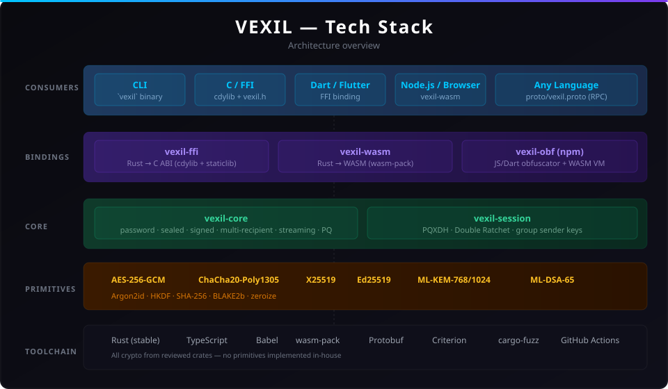
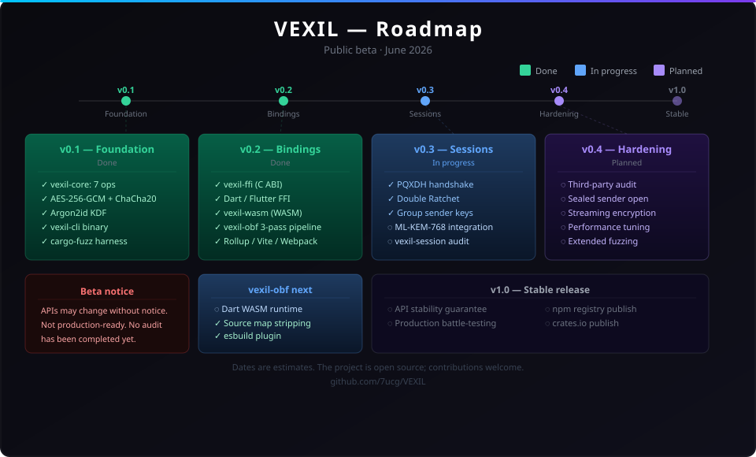

# VEXIL

> **Beta — not production-ready.** APIs may change without notice. No third-party audit has been completed. Test thoroughly before using in any system that handles real user data.

Two things in one repo:

- **Encryption library** — hybrid encryption with a versioned wire format. Password, public-key, signed, multi-recipient, streaming, and post-quantum, all with the same parser.
- **JavaScript obfuscator** — compiles JS to an AES-256-GCM encrypted binary AST that runs inside an embedded WASM VM. Not just renaming and shuffling.



---

## vexil-obf — JavaScript obfuscator

[`packages/vexil-obf`](packages/vexil-obf/) is a standalone npm package. Code is compiled to a custom binary AST, encrypted, and replaced with a VM that decrypts and executes at runtime. There is no source to recover without the per-build key.

```sh
npm install "https://gitpkg.now.sh/7ucg/VEXIL/packages/vexil-obf?main"
```

```js
const { obfuscateJs, PRESETS } = require('vexil-obf');

// quick start with a preset
const { code } = await obfuscateJs(source, PRESETS.max);

// or configure manually
const { code: custom } = await obfuscateJs(source, {
  // pipeline
  pass2: true,              // binary AST + AES-256-GCM VM
  format: 'cjs',           // 'cjs' | 'umd' | 'iife'

  // VM self-defense
  integrityTrap: true,     // XOR checksum — tamper → infinite loop (default true)
  selfDefend: true,        // DevTools timing trap
  debugProtection: true,   // periodic debugger statement
  callStackCheck: true,    // call stack depth guard (default true)
  agentDisrupt: true,      // zero key on Playwright / jsdom / Jest detection (default true)
  antiAnalysis: true,      // webdriver / phantom / proxy detection

  // anti-LLM
  antiLLM: true,           // identifier flood + ghost control flow + string dispersion
  poisonStringArray: true, // ~25 fake API/crypto strings injected into string array
  poisonIdentifiers: true, // 15 dead license/crypto-sounding functions as false context

  // bytecode hardening (always-on when pass2:true — flags accepted for explicitness)
  jumpEncoding: true,      // jump offsets XOR'd per build
  decoyOpcodes: true,      // noise bytes between real instructions
  statefulOpcodes: true,   // accumulator opcodes — naive emulation gives wrong state
  stackEncoding: true,     // scope variable names XOR-encoded in bytecode
  macroOps: true,          // common 2-node patterns fused into single dense opcodes

  // misc
  deadCode: true,          // inject unreachable branches
  envFingerprint: true,    // tie decryption to VOBF_ID env var
  envKeyBind: 'node',      // bind one key byte to runtime fingerprint ('node' | 'browser' | false)
});
```

**What makes it different from javascript-obfuscator / obfuscator.io:**

Other tools work at the JS source level — rename identifiers, shuffle strings, flatten control flow. Someone with enough time and a deobfuscator can still read the logic. vexil-obf compiles the code to a binary format and replaces it with a VM. The encrypted payload can't be read without the key, and the key is reconstructed through a 3-step closure chain with non-linear array indexing, LCG-stream binding, and 6 mixed byte-encoding forms per build.

The pipeline also has specific defenses against LLM-assisted analysis (CASCADE, JSimplifier, webcrack): string table poisoning, identifier poisoning, fake numerical constants, stateful VM opcodes, macro-op aggregation, and token budget drain structures — each targeting a different attack vector used by automated reverse engineering pipelines.

| Feature | vexil-obf | javascript-obfuscator | obfuscator.io |
|---|:---:|:---:|:---:|
| Encrypted binary AST (not just source transforms) | ✓ | — | — |
| AES-256-GCM authenticated payload | ✓ | — | — |
| Per-build shuffled node type IDs | ✓ | — | — |
| Macro-op aggregation (denser bytecode, fewer recognizable patterns) | ✓ | — | — |
| Decoy opcodes (noise bytes between real instructions) | ✓ | — | — |
| Stateful opcodes (accumulator — naive emulation gives wrong results) | ✓ | — | — |
| Jump target encoding (offsets XOR'd per build) | ✓ | — | — |
| Scope name encoding (variable names XOR'd in bytecode) | ✓ | — | — |
| Non-linear 3-part key split | ✓ | — | — |
| Anti-hook (toString check before decryption) | ✓ | — | — |
| Integrity trap (tamper → infinite loop) | ✓ | — | — |
| Call stack validation (unexpected frames → trap) | ✓ | — | — |
| Agent/sandbox disruption (Playwright, jsdom, Jest, webdriver) | ✓ | — | — |
| Proxy trap detection on natives | ✓ | — | — |
| Object.prototype freeze canary | ✓ | — | — |
| String array poisoning (fake API/crypto strings) | ✓ | — | — |
| Identifier poisoning (misleading dead-code names) | ✓ | — | — |
| Fake numerical constants (truncated TAU, PHI, key sizes) | ✓ | — | — |
| Token budget drain (expensive-to-analyze dead structure) | ✓ | — | — |
| DevTools detection + breakpoint neutralization | ✓ | — | — |
| Runtime key binding (env fingerprint) | ✓ | — | — |
| Vite / Rollup / webpack / esbuild plugin | ✓ | — | — |
| Dart / Flutter obfuscation | ✓ | — | — |
| Batch obfuscation API | ✓ | — | — |
| String array with rotation | ✓ | ✓ | ✓ |
| Node.js + browser (UMD/IIFE/CJS) | ✓ | ✓ | — |

Vite, Rollup, webpack, and esbuild plugins included — format auto-detected from bundler config:

```js
// vite.config.js
import { vexilVitePlugin } from 'vexil-obf/vite-plugin';
export default { plugins: [vexilVitePlugin({ pass2: true })] };

// rollup.config.js
import { vexilRollupPlugin } from 'vexil-obf/rollup-plugin';
export default { plugins: [vexilRollupPlugin({ pass2: true })] };

// webpack.config.js
const { VexilWebpackPlugin } = require('vexil-obf/webpack-plugin');
module.exports = { plugins: [new VexilWebpackPlugin({ pass2: true })] };

// esbuild
import { vexilEsbuildPlugin } from 'vexil-obf/esbuild-plugin';
await esbuild.build({ plugins: [vexilEsbuildPlugin({ pass2: true })] });
```

CLI:

```sh
vexil-obf js input.js -o output.js
vexil-obf js input.js -o output.js --format umd
vexil-obf dart lib/secrets.dart -o lib/secrets.obf.dart
```

Full docs: [packages/vexil-obf/README.md](packages/vexil-obf/README.md)

---

## VEXIL encryption

### What's in here

```
crates/vexil-core      Rust library (at-rest encryption)
crates/vexil-session   PQXDH + Double Ratchet + group sender keys
crates/vexil-cli       `vexil` binary
crates/vexil-ffi       C ABI (cdylib + staticlib, Dart binding)
crates/vexil-wasm      WebAssembly bridge (Node.js / browser)
proto/vexil.proto      protobuf contract for any language
```

### Why VEXIL over libsodium / age / OpenSSL

Most tools pick one cipher, one mode, and one encoding and bake it in. Upgrading means a breaking format change. VEXIL puts a suite byte and a mode byte in the header, so:

- A parser written today still reads envelopes made with a cipher added next year.
- You can mix suites in a multi-recipient message (one recipient has a PQ key, another doesn't).
- Streaming, multi-recipient, and signed modes all share one wire format and one parser.
- The post-quantum mode mixes X25519 and ML-KEM through HKDF — the payload stays secret as long as either primitive holds, which defeats harvest-now-decrypt-later.

libsodium gives you box/secretbox/sign but no versioned format — you build the envelope yourself. age is password + recipients only, no signing, no streaming API. OpenSSL CMS is the closest in scope but the format is ASN.1/PKCS and the API surface is large. VEXIL is a small, auditable Rust library with a compact binary format.

### Ways to use it

- **Rust library** — add to `Cargo.toml` and `use vexil_core::*`
- **CLI** — the `vexil` binary
- **C / C++ / any FFI** — `vexil-ffi` (`cdylib` + `vexil.h`)
- **Dart / Flutter** — `crates/vexil-ffi/bindings/dart/`
- **Node.js / browser** — `vexil-wasm`
- **Other languages** — `proto/vexil.proto`

### Binding coverage

| Operation | Rust lib | CLI | C/FFI | Dart | WASM |
|-----------|:--:|:--:|:--:|:--:|:--:|
| password enc/dec | ✓ | ✓ | ✓ | ✓ | ✓ |
| keygen (classical + PQ) | ✓ | ✓ | ✓ | ✓ | ✓ |
| sealed box | ✓ | ✓ | ✓ | ✓ | ✓ |
| signed sealed box | ✓ | ✓ | ✓ | ✓ | ✓ |
| multi-recipient | ✓ | ✓ | ✓ | ✓ | ✓ |
| streaming | ✓ | ✓ | ✓ | ✓ | ✓ |
| detached sign / verify | ✓ | ✓ | ✓ | ✓ | ✓ |
| fingerprint | ✓ | ✓ | ✓ | ✓ | ✓ |
| inspect | ✓ | ✓ | — | — | — |
| PQ session (Double Ratchet) | ✓ | — | ✓ | ✓ | ✓ |
| PQ groups (sender keys) | ✓ | — | ✓ | ✓ | ✓ |
| session / group persistence | ✓ | — | ✓ | ✓ | ✓ |

The CLI is one-shot, so the stateful session/group ratchets are exposed through the library and the FFI/Dart/WASM bindings.

### Install

**CLI:**

```sh
cargo build --release
# binary at target/release/vexil
```

**Rust library:**

```toml
# Cargo.toml
[dependencies]
vexil-core = { git = "https://github.com/7ucg/VEXIL" }

# with post-quantum support
vexil-core = { git = "https://github.com/7ucg/VEXIL", features = ["pq"] }
```

### Quick start

```sh
# password
vexil enc -k "correct horse" -t "secret" > msg.vex
vexil dec -k "correct horse" -f msg.vex

# keys
vexil keygen --name alice --out ~/.vexil/
vexil keygen --name bob   --out ~/.vexil/

# sealed box to bob
vexil enc --to ~/.vexil/bob.pub -t "for bob" > b.vex
vexil dec -i ~/.vexil/bob.identity -f b.vex

# signed: bob can confirm it came from alice
vexil enc --to ~/.vexil/bob.pub --sign-with ~/.vexil/alice.identity -t "hi" > s.vex
vexil dec -i ~/.vexil/bob.identity --from ~/.vexil/alice.pub -f s.vex

# one message, three recipients
vexil enc --to alice.pub --to bob.pub --to carol.pub -t "team" > m.vex

# big file, streamed
vexil enc -k pw --stream -f movie.mkv -o movie.vexf
vexil dec -k pw -f movie.vexf -o movie.out

# fingerprint, list, shell completions
vexil fp --public ~/.vexil/bob.pub
vexil ls
vexil completions bash > /etc/bash_completion.d/vexil
```

Output prefixes: `VEX1-` password, `VEX1S-` sealed, `VEX1A-` signed, `VEX1M-` multi-recipient, `VEX1P-` post-quantum, `VEX1SF-` sealed stream, `VEX1AF-` signed stream, `VEX1MF-` multi-recipient stream.

### Library

```rust
use vexil_core::{encrypt_with_password, decrypt_with_password, seal_to, open_sealed, Identity};

// password
let ct = encrypt_with_password(b"pw", b"secret")?;
let pt = decrypt_with_password(b"pw", &ct)?;

// public key
let bob = Identity::generate();
let ct = seal_to(&bob.public(), b"hello")?;
let pt = open_sealed(&bob, &ct)?;
```

Every `encrypt`/`seal` function has a `*_rng` variant taking an explicit `CryptoRng + RngCore`, so tests can pin the salt and nonce for deterministic output.

### Encodings

`--encoding base89` (default, safe inside source-code string literals), `hex`, `raw` (binary, for pipes), or `pem` (`--armor` is shorthand). Encoding only changes transport; the envelope bytes are the same underneath.

### Benchmarks

Indicative numbers on one desktop CPU, `--release`. Run `cargo bench` for your own machine.

| Operation | Time |
|-----------|------|
| Argon2id derive (64 MiB, t=3, p=4) | ~83 ms |
| Sealed-box encrypt | ~1.8 ms |
| Sealed-box decrypt | ~400 µs |
| Signed-box encrypt | ~2.1 ms |
| Signed-box decrypt | ~540 µs |
| Multi-recipient encrypt (6 recipients) | ~3.9 ms |
| Multi-recipient decrypt (6 recipients) | ~830 µs |
| Streaming PK (ChaCha20-Poly1305), 10 MiB | ~880 MB/s |
| Hex encode, 8 KiB | ~430 MiB/s |
| Base89 decode, 1 KiB | ~300 µs |

Argon2id is meant to be slow; that ~83 ms is the brute-force tax on a password.

### Crypto

Argon2id, ChaCha20-Poly1305, AES-256-GCM, X25519, Ed25519, ML-KEM-768, HKDF, SHA-256, BLAKE2b — all from existing reviewed crates. No primitive is implemented here.

See [PROTOCOL.md](PROTOCOL.md) for the wire format.

### Testing

```sh
cargo test --workspace          # all tests
cargo test -p vexil-core prop   # proptest only (256 cases per property)
cargo bench                     # criterion benchmarks
```

The property tests cover encrypt/decrypt roundtrips, wrong-key rejection, AD binding, session in-order and out-of-order delivery, and session serialization for every mode.

### Post-quantum

```sh
cargo build --release --features pq
```

Two axes:

- **Confidentiality** — suite `0x03` (X25519 + ML-KEM-768) and `0x05` (X25519 + ML-KEM-1024) mix both shared secrets through HKDF. The payload stays secret as long as either the curve or ML-KEM holds.
- **Authenticity** — the PQ signed mode signs with both Ed25519 and ML-DSA-65; a verifier accepts only if both check.

```rust
# #[cfg(feature = "pq")] {
use vexil_core::pq_identity::{PqIdentity, seal_signed_pq, open_signed_pq};
let bob = PqIdentity::generate();
let alice = PqIdentity::generate();
let ct = seal_signed_pq(&bob.public(), &alice, b"quantum-safe").unwrap();
let (pt, _sender) = open_signed_pq(&bob, &ct, Some(&alice.public())).unwrap();
assert_eq!(pt, b"quantum-safe");
# }
```

Suite `0x04` (X-Wing KEM) is reserved but not implemented — dependency conflicts with the current `ml-kem` stack. ML-KEM-1024 covers the higher-security need without that risk.

---

## Roadmap



---

## License

MIT. See [LICENSE](LICENSE).
